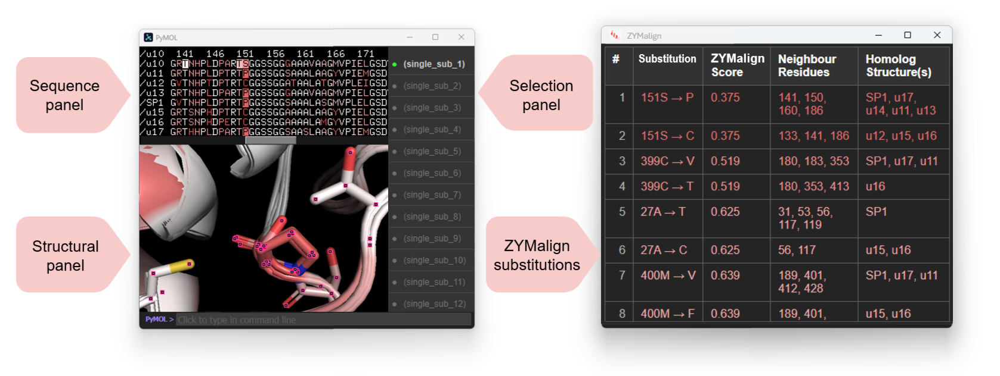

[Webserver](https://services.healthtech.dtu.dk/services/SIMAlign-1.0/)

ZYMalign is a structural alignment tool for identifying non-disrupting amino acid substitutions, referred to as substitution hotspots, from homologous protein structures. The program uses either Foldseek-detected homologs or user-specified homologs to generate structural alignments and residue-level similarity scores. In parallel, ZYMalign generates a multiple sequence alignment that is refined using structural information to produce a structure-based multiple sequence alignment (SB-MSA), which is used to identify substitution hotspots.


[](LICENSE)

## Features

* Automatic homology search with **Foldseek** or user-specified templates
* Supports `.pdb` and `.cif` file formats
* Gap recognition and RMSD filtering for precise alignment
* Similarity scoring using **BLOSUM** matrices
* Hotspot prediction for single and double substitutions
* PyMOL session generation (`.pse`) for interactive visualization
* Outputs: JSON scores, HTML hotspot reports, Clustal alignments

## Installation

### 1. Clone the repository
> **Note:** Do **not** include any spaces in the path where you clone the repo.

```bash
git clone https://github.com/morth-lab/ZYMalign.git
cd ZYMalign
```

### 2. Conda environment

```bash
conda env create -f environment.yml
conda activate zymalign_env
```


## Usage

```bash
python scripts/ZYMalign.py --QUERY query.pdb [options]
```


### Common Options

| Option (`-short`)               | Description                                                        | Default       |
| ------------------------------- | ------------------------------------------------------------------ | ------------- |
| `--QUERY` `-q`                  | Path to input structure file (`.pdb` or `.cif`). **Required**      | —             |
| `--HOMOLOGS` `-hom`              | Two or more homolog files (for `user_specified`).                 | `None`        |
| `--HOMOLOGS_DIR` `-hom-dir`      | Directory of homolog files (for `user_specified`).                | `None`        |
| `--HOMOLOGY_SEARCH_METHOD` `-H` | `foldseek` or `user_specified`.                                    | `foldseek`    |
| `--MAX_DISTANCE` `-d`           | Distance threshold for gap detection (Å).                          | `5`           |
| `--MAX_RMSD` `-r`               | Maximum RMSD for homolog filtering (Å).                           | `5`           |
| `--FOLDSEEK_DATABASES` `-fd`    | Foldseek DBs (`afdb50`,`afdb_swissprot`,`afdb_proteome`,`pdb100`). | `afdb50`      |
| `--FOLDSEEK_MODE` `-fm`         | `tmalign` or `3diaa`.                                              | `tmalign`     |
| `--FOLDSEEK_THRESHOLD` `-ft`    | Foldseek score/E-value threshold.                                  | `0.7`         |
| `--NUMB_HOMOLOGS` `-nh`        | Number of top homologs.                                           | `20`          |
| `--BLOSUM` `-b`                 | BLOSUM matrix (`BLOSUM50`,`BLOSUM62`).                             | `BLOSUM62`    |
| `--RESULT_DIR` `-R`             | Directory for results.                                             | `./<JOB_KEY>` |
| `--TMP_DIR` `-tmp`              | Directory for temporary files.                                     | `./tmp`       |
| `--JOB_KEY` `-j`                | Job name key. Auto-generated if omitted.                           | random        |
| `--only_core`  	                | If set to 1, only hotspots in the core of the protein will be considered.  | `1` |


## Output

ZYMalign produces two complementary outputs: an interactive PyMOL visualization and a ranked table of substitution hotspots.



<h3>Interactive PyMOL visualization</h3>

<p>
The PyMOL session file enables interactive inspection of the structural alignment, residue-level similarity scores, and predicted substitution hotspots. The visualization is organized into synchronized sequence, structure, and selection panels. Selecting a substitution hotspot highlights the corresponding position in both the sequence and three-dimensional structure, making it possible to inspect the local structural environment of each candidate substitution.
</p>

<h3>Substitution hotspot table</h3>

<p>
The substitution hotspot table lists predicted non-disrupting amino acid substitutions ranked by their ZYMalign score. Substitutions with the lowest ZYMalign scores are shown at the top of the table, corresponding to less conserved positions that may be more likely to tolerate substitution. These top-ranked candidates provide a practical starting point for experimental mutagenesis.
</p>

<h3>Full list of all files:</h3>

* `alignment.aln` – Structure-based multiple sequence alignment (Clustal format)
* `hotspots_mode_1.html` – Single substitution hotspot report
* `hotspots_mode_2.html` – Double substitution hotspot report
* `scores.json` – Per-residue similarity scores (ZYMalign score)
* `sequences.fasta` – Query and homolog sequences (fasta format)
* `ZYMalign_<JOB_KEY>.pse` – PyMOL session file
* `<JOB_KEY>_log.txt` – Log file
* Homolog AlphaFold structures if you used `foldseek`

<!-- ## Citation

Please cite our [publication](https://services.healthtech.dtu.dk/services/SIMAlign-1.0/) if you use SIMalign:

```bibtex
@article{ostergaard2025simplicity,
  title={SIMalign: Structure-based alignment and hotspot prediction for protein engineering},
  author={Ostergaard, M. et al.},
  journal={Journal of Molecular Biology},
  year={2025},
  doi={10.1016/j.jmb.2025.03.012}
}
``` -->


## Acknowledgments

* **PyMOL Script Repository** for `findSurfaceResidues.py`
* Developed with support from ChatGPT
